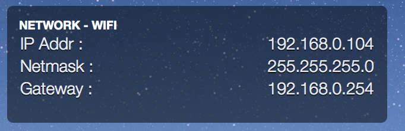

# Set-networking.widget (Fork)

## Screenshot

## Description
Übersicht widget to switch between static IP and DHCP, and show current IP address, Netmask and Gateway and allow you to change their values (when using static IP Address)

Currently only for the Wi-Fi interface. You can change to be used on other interfces by changing "Wi-Fi" to the System Preferences name for the interface you wish to use, in the index.coffee file, and changing en0 to the ifconfig interface name for the same interface in the getnet.sh file

This does not add DNS settings so you will need to add those manually in System Preferences.

## Utilisation
You may need to chmod +x getnet.sh in order to get the current settings to output correctly. 

When changing the settings using the widget, the system will ask you to unput your password, I dont think there is a way around this. 

To interact with the widget, hold down the hot key that you have specified in your Ubersicht preferences.

## Sources
Style based on DiskUsage-Bar-Widget : <a href="https://github.com/dinever/DiskUsage-Bar-Widget">Sources on Github</a>

